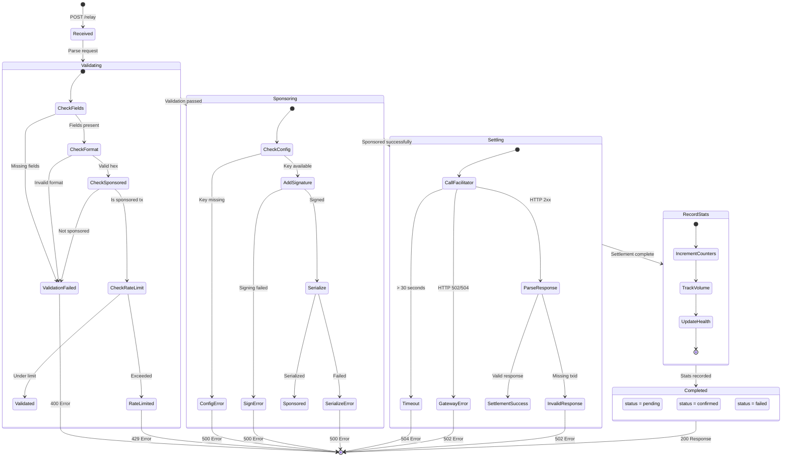

# Transaction State Machine

This document describes the state machine for transactions processed by the x402 Sponsor Relay.

## State Diagram

## State Descriptions

| State | Description | Duration |
|-------|-------------|----------|
| **Received** | Request received at `/relay` endpoint | Instant |
| **Validating** | Parsing and validating request body, checking rate limits | < 10ms |
| **Sponsoring** | Adding relay's signature to pre-signed transaction | < 50ms |
| **Settling** | Calling facilitator API to broadcast and verify settlement | 1-30s |
| **RecordStats** | Recording metrics to KV storage | < 100ms |
| **Completed** | Transaction processed, response returned | Terminal |

## Error States

| Error State | HTTP Code | Cause | Recovery |
|-------------|-----------|-------|----------|
| ValidationFailed | 400 | Invalid request format, missing fields | Client fixes request |
| RateLimited | 429 | Exceeded 10 req/min/sender | Client waits and retries |
| ConfigError | 500 | Sponsor key not configured | Operator action required |
| SignError | 500 | Transaction signing failed | Investigate tx format |
| SerializeError | 500 | Serialization failed | Investigate tx structure |
| Timeout | 504 | Facilitator didn't respond in 30s | Client can retry |
| GatewayError | 502 | Facilitator returned error | Client can retry |
| InvalidResponse | 502 | Facilitator response malformed | Operator investigation |

## Current Flow Characteristics

### Synchronous Processing
- All operations happen in-line within a single HTTP request
- No background processing or deferred execution
- Response includes final settlement status

### Structured Error Responses ✅
- All errors include `retryable` flag
- `Retry-After` header for transient errors
- Error codes documented in OpenAPI spec
- Client handles retries with guidance

### Fee Tracking ✅
- Fee extracted from each sponsored transaction
- Stored in daily and hourly stats
- Dashboard shows total, average, min, max fees
- Hourly fee breakdown for time-series analysis

### Pending Improvements
- Sponsor account balance monitoring
- Budget controls (optional)
- Server-side retry queue (optional)

## Related Documentation

See [Feature Roadmap](./feature-roadmap.md) for implementation status and future plans.
